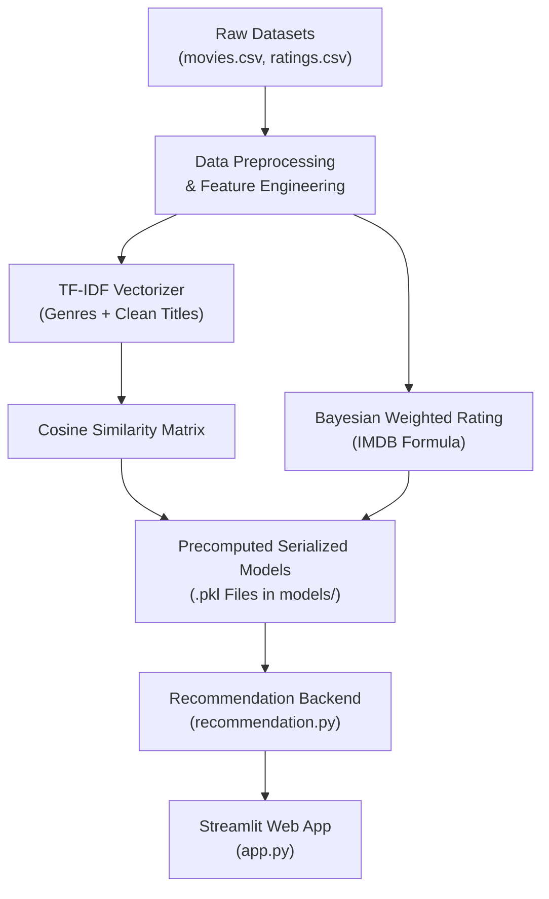

# 🎬 Movie Recommendation System (CineMind)


An intelligent, state-of-the-art **Movie Recommendation System** built using Content-Based Filtering (TF-IDF Vectorization & Cosine Similarity) and Bayesian Weighted Rating metrics. Features a dark glassmorphism Streamlit web application.

---

## 🌟 Key Features

- **🔍 Content-Based Recommendation Engine**: Computes similarity across movie titles and genres using **TF-IDF Vectorization** & **Cosine Similarity Matrix**.
- **🔥 Bayesian Weighted Popularity Rankings**: Calculates IMDB-style weighted rating formula taking rating counts and average scores into account.
- **🏷️ Multi-Genre Filtering**: Explore recommendations filtered by specific genres (Action, Comedy, Drama, Sci-Fi, etc.).
- **🎛️ Interactive Sliders & Thresholds**: Filter recommendations by minimum rating threshold and number of recommendations.
- **🎲 'Surprise Me!' Mode**: Instant random high-rated movie picker.
- **🎬 Trailer Access**: Direct links to YouTube trailers for recommended movies.
- **⚡ Precomputed Fast Pickles**: Serialized top-nearest neighbors matrix (`models/similarity.pkl`) for sub-50ms recommendation generation.

---

## 📂 Project Structure

```
Movie-Recommendation-System/
│
├── dataset/
│   ├── movies.csv          # Movie IDs, titles, and genre tags (10,329 movies)
│   └── ratings.csv         # User IDs, movie IDs, ratings, and timestamps (105,339 ratings)
│
├── notebook/
│   └── Movie_Recommendation_System.ipynb   # Comprehensive EDA & model building notebook
│
├── models/
│   ├── movie_list.pkl      # Preprocessed movie metadata & weighted rating scores
│   ├── similarity.pkl     # Precomputed similarity matrix top-100 nearest neighbors
│   └── tfidf_vectorizer.pkl # Fitted Scikit-Learn TF-IDF vectorizer
│
├── app.py                  # Streamlit web application (Glassmorphism dark UI)
├── recommendation.py       # Modular recommendation engine backend logic
├── build_models.py         # Automated model training script
├── test_recommendation.py  # Engine unit verification test script
├── requirements.txt        # Python dependency declarations
├── README.md               # Detailed project documentation
├── .gitignore              # Git ignore rules
└── screenshots/
    └── app_preview.png     # Web application visual interface preview
```

---

## 🏗️ System Architecture



---

## 🚀 Getting Started

### 1. Prerequisites
Ensure Python 3.9+ is installed on your system.

### 2. Clone / Navigate to Directory
```bash
cd Movie-Recommendation-System
```

### 3. Install Dependencies
```bash
pip install -r requirements.txt
```

### 4. Build Models (Optional - Precomputed models are included)
To re-train and re-generate the model pickle files:
```bash
python build_models.py
```

### 5. Launch Web Application
```bash
streamlit run app.py
```

---

## 🧪 Verification & Testing

To test the backend engine programmatically:
```bash
python test_recommendation.py
```

---

## 📊 Dataset Statistics

- **Total Movies**: 10,329
- **Total User Ratings**: 105,339
- **Unique Genres**: 19 (Action, Adventure, Animation, Children, Comedy, Crime, Documentary, Drama, Fantasy, Film-Noir, Horror, IMAX, Musical, Mystery, Romance, Sci-Fi, Thriller, War, Western)

---

## 📄 License

This project is open-source and available under the [MIT License](LICENSE).
